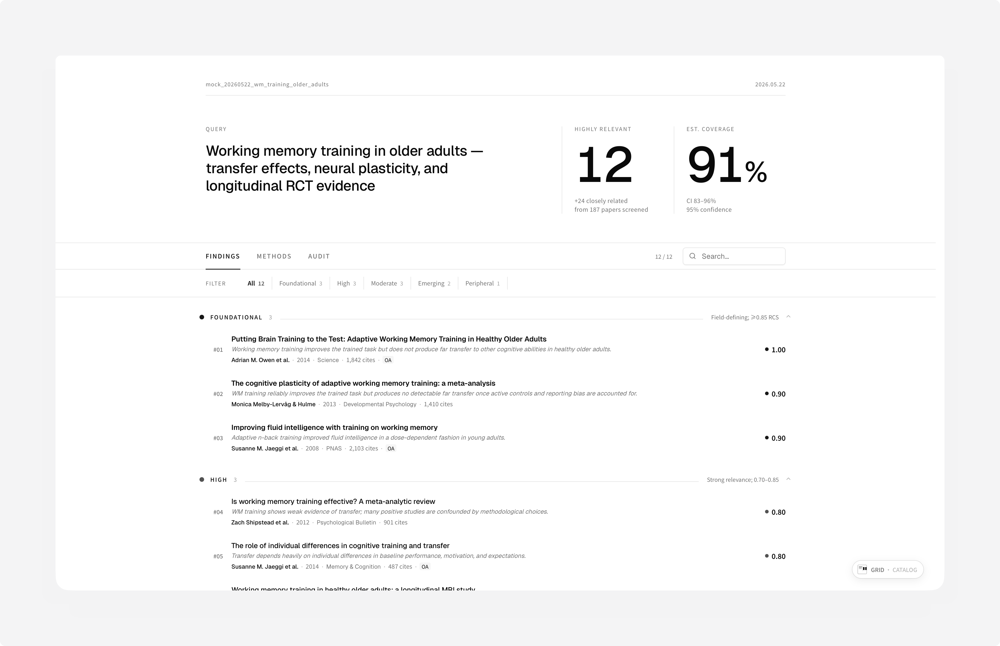
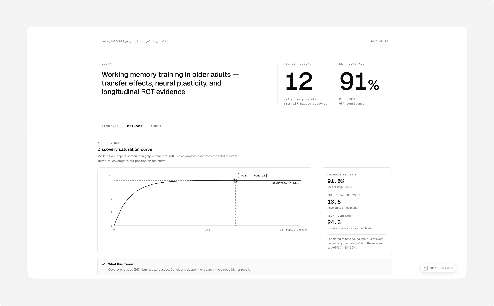
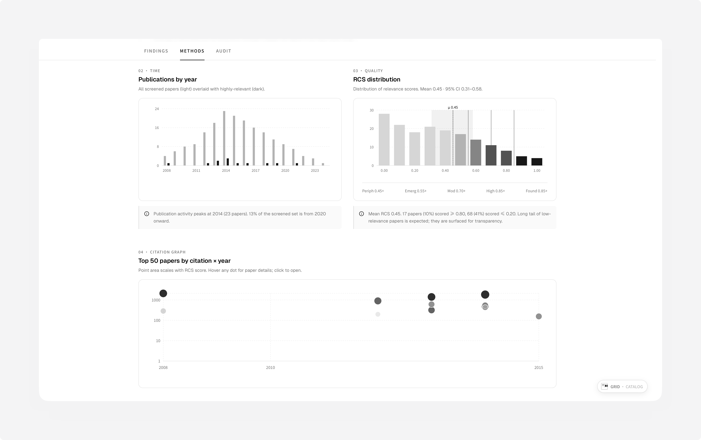
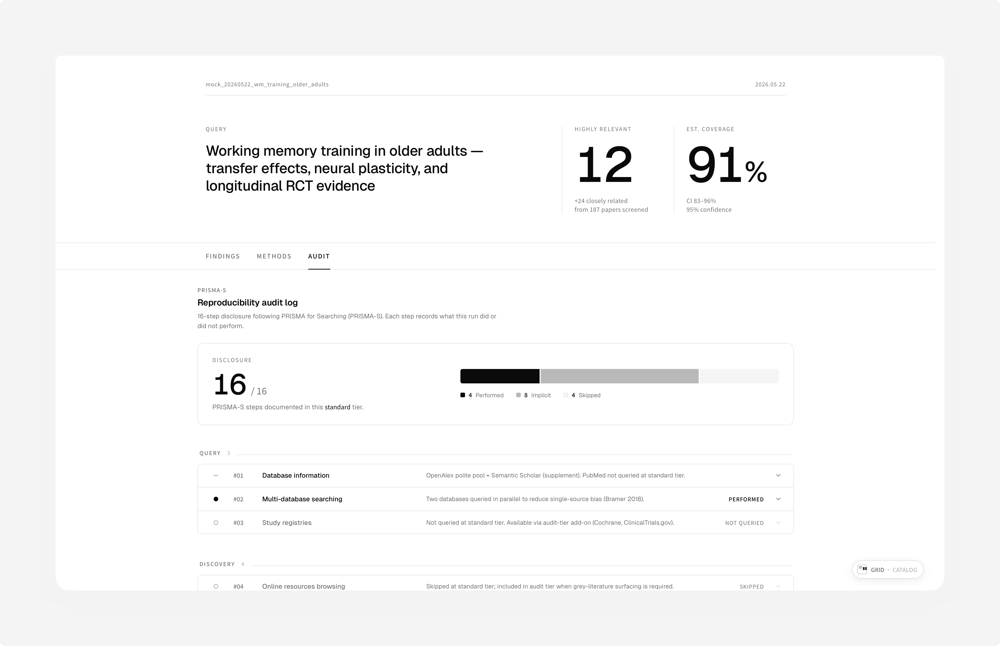
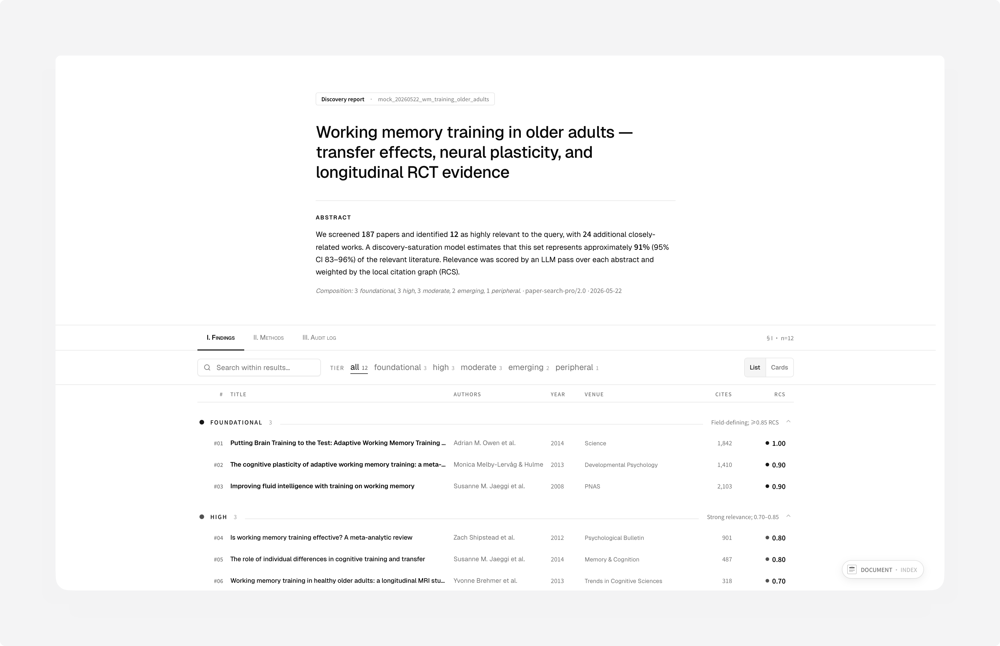

<div align="right">

**English** · [中文](./README.zh.md)

</div>

<br />

<div align="center">

# paper-search-pro

**Academic literature discovery as a Skill.**
<br/>
Built natively for Claude Code; runs in Codex and any agent that loads the SKILL.md format.
<br/>
Five sources · four tiers · single-file Shadcn report.

<br/>

<a href="LICENSE.txt"></a>
<a href="SKILL.md"></a>


</div>

<br/>



<div align="center">

**[→ Live demo (opens the actual report in your browser)](https://o0000-code.github.io/paper-search-pro/)**

</div>

<br/>

## What it does

You ask your agent for papers; this Skill runs a real multi-source literature search across **OpenAlex · Semantic Scholar · CrossRef · PubMed · arXiv**, classifies relevance via parallel LLM SubAgents, and writes a self-contained HTML report you can open in any browser. No external LLM keys — your agent **is** the LLM.

```text
In your agent's chat, after install:

  Find papers on working memory training in older adults
```

CJK in the query routes to Chinese UI; otherwise English. Both report flavors use the same data pipeline.

<br/>

## Use cases

| Scenario | Tier | What you get |
|---|:---:|---|
| Scope a topic before writing the proposal | Quick / Standard | 20–60 top-RCS papers + 300-word executive summary in 8 min |
| Background section for course paper / thesis chapter | Standard | 60–180 papers screened, BibTeX ready for Zotero / Mendeley |
| Writing a review article — need real domain coverage | Deep | 180–400 papers + 1-hop citation chasing + topic clustering |
| SR-prep: PRISMA log + reproducibility audit | Audit | 400–1000+ papers, PRISMA-S 16-item disclosure, MeSH-precise |
| Onboarding a research assistant in a new field | Quick | Hand them the report.html — three tabs, hover for context |

<br/>

## Install

Clone into your agent's Skills directory, then install Python deps:

```bash
# Claude Code (native Skill support)
git clone https://github.com/O0000-code/paper-search-pro.git \
  ~/.claude/skills/paper-search-pro

# Codex — clone into your Codex skills root (varies by version)
# Other agents — see your agent's documentation for the SKILL.md format
#                loader location

python3 -m pip install -r ~/.claude/skills/paper-search-pro/scripts/requirements.txt
```

Five free API keys (~15 min total) — see [`references/setup.md`](references/setup.md).

<br/>

## Four tiers

The Skill picks **Standard** by default. Wording like *thorough*, *systematic review*, or *几篇* overrides.

| | Tier | Wall-clock | Papers | Trigger signals |
|:---:|:---|:---:|:---:|:---|
| `▏` | Quick | 5–8 min | 20–60 | *scan · "5 papers" · before-tomorrow scope* |
| `▍` | **Standard** | 10–17 min | 60–180 | *default — background reading · course paper* |
| `▋` | Deep | 30–45 min | 180–400 | *review article · thorough coverage · 综述写作* |
| `█` | Audit | 2–3 hr | 400–1000+ | *systematic review · PRISMA · Cochrane-adjacent* |

<br/>

## What each report contains

Three tabs · three hero layouts · two list densities · responsive at 860 px · bilingual UI · Noto Sans SC inlined · fully offline.

<table>
  <tr>
    <td width="50%" valign="top">
      <a href="docs/screenshots/methods.png"></a>
      <br/>
      <sub><strong>Methods · Coverage</strong> — saturation curve, model fit, current position on the curve.</sub>
    </td>
    <td width="50%" valign="top">
      <a href="docs/screenshots/methods-2.png"></a>
      <br/>
      <sub><strong>Methods · Distribution</strong> — publications by year, RCS histogram, citation scatter.</sub>
    </td>
  </tr>
  <tr>
    <td valign="top">
      <a href="docs/screenshots/audit.png"></a>
      <br/>
      <sub><strong>Audit · PRISMA-S</strong> — 16-item disclosure log: performed · implicit · skipped.</sub>
    </td>
    <td valign="top">
      <a href="docs/screenshots/discovery-report.png"></a>
      <br/>
      <sub><strong>Discovery Report layout</strong> — preprint-style hero with abstract paragraph + Roman tabs.</sub>
    </td>
  </tr>
</table>

Outputs land in `$PWD/paper-search-results/<search_id>/`:

```text
report.html         Self-contained Shadcn report (opens directly in browser)
report.md           Markdown variant for pandoc · citation managers
papers.csv          Spreadsheet export
papers.bib          BibTeX for Zotero · Mendeley · LaTeX
papers.ris          RIS for EndNote · Papers
papers.json         Full structured data (UnifiedPaperEntity[])
kg_classified.json  Internal KG with per-paper RCS scores
execution_log.json  PRISMA-S 16-item disclosure log
summary.md          300-word executive summary in the main agent's voice
```

<br/>

## Configuration

Five keys, all free, ~15 min total. Real config lives at `~/.paper-search-pro/config.yaml` (mode 0600, auto-created). Template lives at [`assets/default_config.yaml`](assets/default_config.yaml).

| Layer | Source | Role | Cost | Apply at |
|:---:|:---|:---|:---:|:---|
| **L1** | OpenAlex | primary — always on | free | <https://openalex.org/keys> |
| **L2** | PubMed | medical · MeSH enricher | free | <https://account.ncbi.nlm.nih.gov/settings/> |
| **L2** | arXiv | preprint freshness (T-0~T-4) | free | *(no signup — SDK enforces 1 req / 3 s)* |
| **L3** | Semantic Scholar | influentialCitationCount + abstract fallback | free | <https://www.semanticscholar.org/product/api> |
| **L3** | CrossRef | funder · license · clinical-trial-number | free | *(no key — `crossref_email` only)* |

Verify readiness any time:

```bash
PYTHONPATH=~/.claude/skills/paper-search-pro python3 -c \
  "from scripts.config import load_config; c = load_config(); \
   print('ready' if (c.openalex_email or c.openalex_api_key) and c.ncbi_email else 'missing')"
```

<br/>

## How it works

A 14-step recipe in [`SKILL.md`](SKILL.md) drives every run. Python helpers in [`scripts/`](scripts/) do deterministic API work; relevance classification is delegated to up to five parallel SubAgents per round. No third-party LLM keys required — your agent is the LLM.

```
        ┌──────────────────────────────────────────────────────────┐
        │  Main agent reads SKILL.md (recipe) and drives the run   │
        └────────┬───────────────────────────────────────┬─────────┘
                 │                                       │
                 ▼                                       ▼
         ┌───────────────┐                       ┌───────────────┐
         │    Python     │ ← deterministic API   │   SubAgents   │
         │    helpers    │   work; no LLM,       │   (parallel,  │
         │               │   no LLM key          │    5 / round) │
         └───────┬───────┘                       └───────┬───────┘
                 │                                       │
                 └───────────────────┬───────────────────┘
                                     ▼
                       ┌─────────────────────────────┐
                       │  Single-file HTML report    │
                       │  + MD + BibTeX + RIS        │
                       │  + CSV + PRISMA-S log       │
                       └─────────────────────────────┘
```

Seventeen per-step reference documents live in [`references/`](references/) — tier decisions, query planning (PICO / SPIDER / PEO), source routing, helper cheatsheets, the RCS rubric, stop conditions, citation chasing, the classifier SubAgent prompt, the PRISMA-S 16-item checklist, summary writer guide, error handling, output conventions.

<br/>

## License

Apache License 2.0 — see [`LICENSE.txt`](LICENSE.txt).
