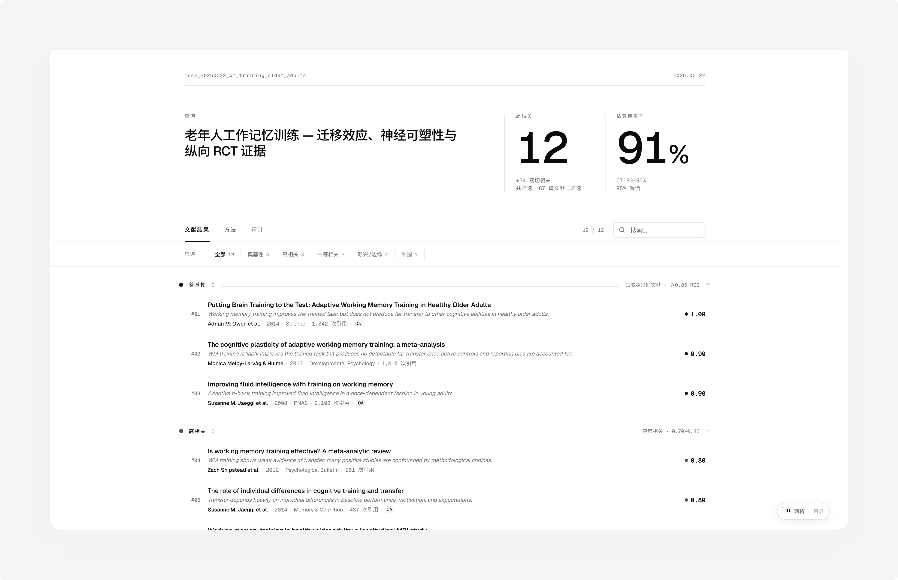
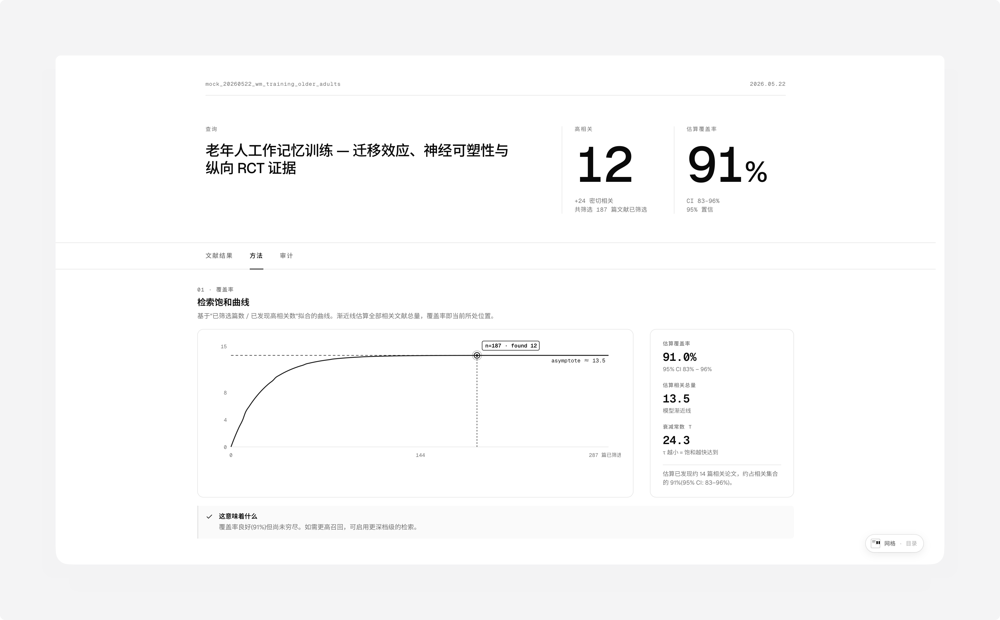
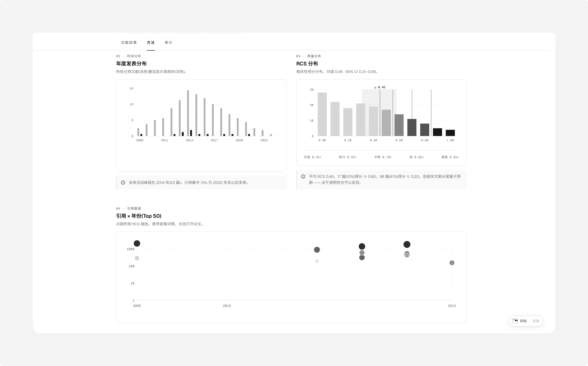
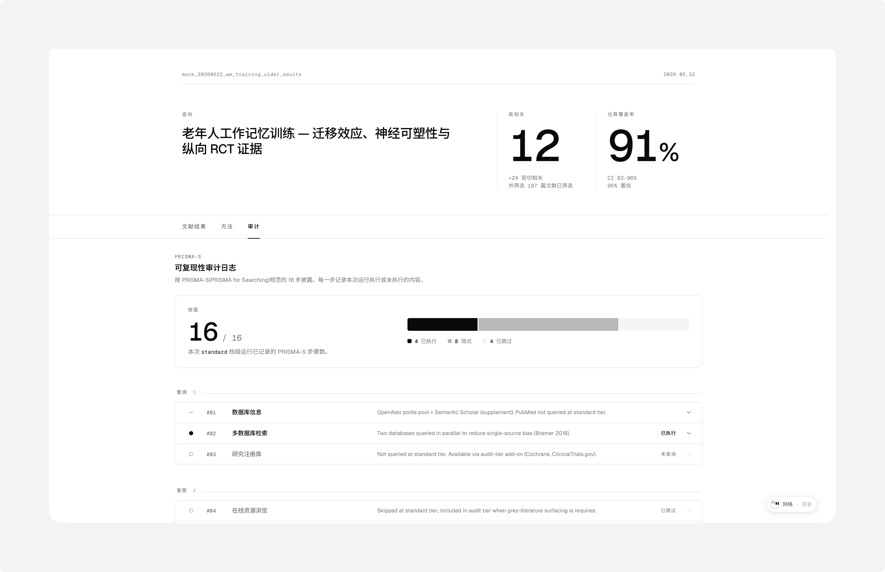
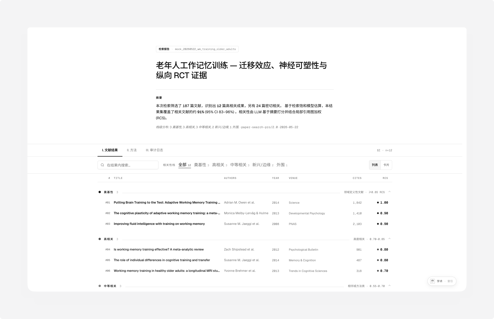

<div align="right">

[English](./README.md) · **中文**

</div>

<br />

<div align="center">

# paper-search-pro

**以 Skill 形式提供的学术文献检索工具。**
<br/>
原生支持 Claude Code；也可在 Codex 等加载 SKILL.md 格式的 Agent 中使用。
<br/>
五源 · 四档 · 单文件 Shadcn 报告。

<br/>

<a href="LICENSE.txt"></a>
<a href="SKILL.md"></a>


</div>

<br/>



<div align="center">

**[→ 在线 Demo（浏览器直接打开真实报告）](https://o0000-code.github.io/paper-search-pro/)**

</div>

<br/>

## 它做什么

你在 Agent 对话框中请求文献，这个 Skill 跨 **OpenAlex · Semantic Scholar · CrossRef · PubMed · arXiv** 五个数据源做真实检索，通过并行 LLM SubAgent 进行相关性分级，输出一份单文件 HTML 报告，浏览器直接打开。无需第三方 LLM key — 你的 Agent 本身就是 LLM。

```text
安装后，在你的 Agent 中：

  找一些关于老年人工作记忆训练的文献
```

查询中含 CJK 字符 → 中文报告，否则 → 英文报告。两种版本走完全相同的数据流程。

<br/>

## 使用场景

| 场景 | 档级 | 你会得到 |
|---|:---:|---|
| 写 proposal 前先 scope 主题 | Quick / Standard | 8 分钟内 20–60 篇高 RCS 文献 + 300 字执行摘要 |
| 课程论文 / 学位论文章节的 background | Standard | 60–180 篇筛选，BibTeX 直接 import 到 Zotero / Mendeley |
| 综述论文 — 需要真正的领域覆盖 | Deep | 180–400 篇 + 1 跳引文追溯 + 主题聚类 |
| SR 准备：PRISMA 日志 + 可复现性审计 | Audit | 400–1000+ 篇，PRISMA-S 16 项披露，MeSH 精确 |
| 给新加入的研究助理快速过一个领域 | Quick | 把 report.html 直接发给 ta — 三个 Tab，hover 看上下文 |

<br/>

## 安装

clone 到你 Agent 的 Skills 目录，然后装 Python 依赖：

```bash
# Claude Code（原生 Skill 支持）
git clone https://github.com/O0000-code/paper-search-pro.git \
  ~/.claude/skills/paper-search-pro

# Codex   — clone 到你 Codex 的 skills 根目录（版本而异）
# 其它    — 以你 Agent 的 SKILL.md 格式 loader 文档为准

python3 -m pip install -r ~/.claude/skills/paper-search-pro/scripts/requirements.txt
```

5 个免费 API key（共约 15 分钟）— 见 [`references/setup.md`](references/setup.md)。

<br/>

## 四个档级

默认为 **Standard**。出现 *深度*、*系统综述*、*几篇*、*thorough* 等关键词自动升档或降档。

| | 档级 | 实际耗时 | 文献数 | 触发信号 |
|:---:|:---|:---:|:---:|:---|
| `▏` | Quick | 5–8 分钟 | 20–60 | *扫一眼 · "几篇" · 明天前要完成* |
| `▍` | **Standard** | 10–17 分钟 | 60–180 | *默认 — 背景阅读 · 课程论文* |
| `▋` | Deep | 30–45 分钟 | 180–400 | *综述写作 · 深度领域覆盖 · review article* |
| `█` | Audit | 2–3 小时 | 400–1000+ | *systematic review · PRISMA · Cochrane 级严谨度* |

<br/>

## 每份报告包含什么

三个 Tab · 三种 Hero 布局 · 两种列表密度 · 860 px 断点完整响应式 · 中英文 UI · Noto Sans SC 字体内嵌 · 完全离线。

<table>
  <tr>
    <td width="50%" valign="top">
      <a href="docs/screenshots/methods-zh.png"></a>
      <br/>
      <sub><strong>方法 · 覆盖率</strong> — 检索饱和曲线、模型拟合、当前位置。</sub>
    </td>
    <td width="50%" valign="top">
      <a href="docs/screenshots/methods-2-zh.png"></a>
      <br/>
      <sub><strong>方法 · 分布</strong> — 年度发表分布、RCS 分布、引用图谱。</sub>
    </td>
  </tr>
  <tr>
    <td valign="top">
      <a href="docs/screenshots/audit-zh.png"></a>
      <br/>
      <sub><strong>审计 · PRISMA-S</strong> — 16 项披露日志：已执行 · 隐式 · 已跳过。</sub>
    </td>
    <td valign="top">
      <a href="docs/screenshots/discovery-report-zh.png"></a>
      <br/>
      <sub><strong>Discovery Report 布局</strong> — Preprint 风格 Hero + 摘要段落 + 罗马数字 Tab。</sub>
    </td>
  </tr>
</table>

输出落在 `$PWD/paper-search-results/<search_id>/`：

```text
report.html         单文件 Shadcn 报告（浏览器直接打开）
report.md           Markdown 版本，供 pandoc · 文献管理器使用
papers.csv          表格化导出
papers.bib          BibTeX，供 Zotero · Mendeley · LaTeX
papers.ris          RIS，供 EndNote · Papers
papers.json         完整结构化数据 (UnifiedPaperEntity[])
kg_classified.json  内部 KG，含逐篇 RCS 评分
execution_log.json  PRISMA-S 16 项披露日志
summary.md          300 字执行摘要（主 Agent 撰写）
```

<br/>

## 配置

5 个 key、全部免费、共约 15 分钟。真实配置位于 `~/.paper-search-pro/config.yaml`（首次运行自动创建，权限 0600）。模板位于 [`assets/default_config.yaml`](assets/default_config.yaml)。

| 层 | 数据源 | 角色 | 成本 | 申请地址 |
|:---:|:---|:---|:---:|:---|
| **L1** | OpenAlex | 主源 — 始终启用 | free | <https://openalex.org/keys> |
| **L2** | PubMed | 医学 · MeSH 富化 | free | <https://account.ncbi.nlm.nih.gov/settings/> |
| **L2** | arXiv | preprint freshness (T-0~T-4) | free | *（无需注册 — SDK 自带 1 req / 3 s 限速）* |
| **L3** | Semantic Scholar | influentialCitationCount + 摘要回退 | free | <https://www.semanticscholar.org/product/api> |
| **L3** | CrossRef | funder · license · clinical-trial-number | free | *（无需 key — 仅需 `crossref_email`）* |

随时验证就绪状态：

```bash
PYTHONPATH=~/.claude/skills/paper-search-pro python3 -c \
  "from scripts.config import load_config; c = load_config(); \
   print('ready' if (c.openalex_email or c.openalex_api_key) and c.ncbi_email else 'missing')"
```

<br/>

## 工作原理

[`SKILL.md`](SKILL.md) 中的 14 步 recipe 驱动每次运行。[`scripts/`](scripts/) 中的 Python helpers 处理所有确定性 API 工作；相关性分级委派给最多 5 个并行 SubAgent / 轮。无需第三方 LLM key — 你的 Agent 本身就是 LLM。

```
        ┌──────────────────────────────────────────────────────────┐
        │  主 Agent 读取 SKILL.md (recipe) 并驱动整轮 run          │
        └────────┬───────────────────────────────────────┬─────────┘
                 │                                       │
                 ▼                                       ▼
         ┌───────────────┐                       ┌───────────────┐
         │    Python     │ ← 确定性 API 工作     │   SubAgents   │
         │    helpers    │   无 LLM、无 LLM key  │  （并行、     │
         │               │                       │   5 / 轮）    │
         └───────┬───────┘                       └───────┬───────┘
                 │                                       │
                 └───────────────────┬───────────────────┘
                                     ▼
                       ┌─────────────────────────────┐
                       │  单文件 HTML 报告           │
                       │  + MD + BibTeX + RIS        │
                       │  + CSV + PRISMA-S log       │
                       └─────────────────────────────┘
```

17 份分步 reference 文档位于 [`references/`](references/) — 档级决策、查询规划（PICO / SPIDER / PEO）、源路由、helper cheatsheet、RCS 评分准则、停止条件、引文追溯、SubAgent prompt、PRISMA-S 16 项 checklist、summary 撰写指南、错误处理、输出规范。

<br/>

## License

Apache License 2.0 — 见 [`LICENSE.txt`](LICENSE.txt)。
